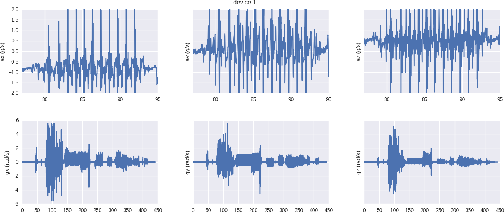
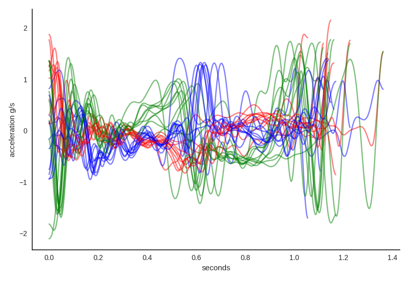
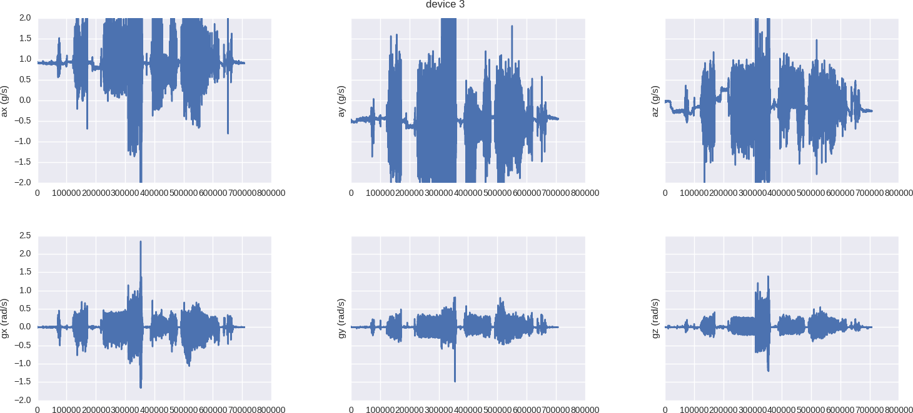

# Trapezium

Gyroscope and accelerometer measurements of the human body.

### Data collection

Sample data output:

```
3 452299760 15144 -7869 -606 -25 31 22
0 452244271 15099 -7581 -4928 9 26 41
1 452188739 -12989 2879 9970 199 -202 -69
2 452133211 16079 2566 2249 -91 33 68
3 452014296 15089 -7938 -585 -21 30 21
0 451958762 15108 -7594 -4867 11 29 42
1 451903483 -13102 2701 10252 201 -180 -71
2 451763466 16127 2764 2145 -46 20 87
3 451510744 15248 -7903 -496 -25 28 20
0 451455242 15128 -7554 -4902 10 27 46
```

Field order
```
device timestamp ax ay az gx gy gz
```

Notes on the data fields:

+ The timestamp is the output of a "binary counter: attached to the CPU clock. In fact, it is a 32 bit binary counter, and the CPU clock speed is 200 MHz. It counts down from 0xFFFFFFFF and when it hits zero it repeats. A difference of one timestamp = 1 / 200*10^6 seconds.
+ Each sensor should be outputting data at 400 samples/second.
+ If you want to convert the gyrometer data to "degrees/sec", multiply by 2000 and divide by 2^15.
+ The accelerometers always have a "DC bias" induced by the acceleration of gravity. To convert from the integer-valued acceleration to units of "gs" divide by 2^14.
+ The accelerometers "clip" at 4g's or a maximum integer value of +/- 2^15. For fast activities such as sprinting we have the option of changing the ceiling to 8g's or even 16g's.
+ Notes on power lights: 1] is streaming computer 2] is recording to flash memory 3] is data already written to flash memory (that is, do we need to clear it) 

#### 6/25/17 First field test

Took several measurements walking, jogging, running, sprinting, backwards walking, jumping, squats, and stairs. Sensor device order (1-4-2-3) mounted roughly on the waist, upper thigh, top of knee, and above the ankle.

Sample measurements should have taken approximately these time intervals:

+ setup ~80s
+ walking 53s
+ jogging 26s
+ sprint < 8s
+ setup 15.5s
+ jumping 23.5s
+ squats 15s
+ setup 33s
+ downstairs 15s
+ upstairs 20s

Walking data for the knee



Segmented walking data



Full dataset plotted for lower leg



<blockquote class="twitter-tweet" data-lang="en"><p lang="en" dir="ltr">Body <a href="https://twitter.com/hashtag/hack?src=hash">#hack</a> <a href="https://twitter.com/hashtag/experiments?src=hash">#experiments</a> ongoing with <a href="https://twitter.com/EricHaengel">@EricHaengel</a>. Measurements of acceleration above the knee while walking. Full body scans coming soon. <a href="https://t.co/guLCXpp11l">pic.twitter.com/guLCXpp11l</a></p>&mdash; Travis Hoppe (@metasemantic) <a href="https://twitter.com/metasemantic/status/881317564680478720">July 2, 2017</a></blockquote>
<script async src="//platform.twitter.com/widgets.js" charset="utf-8"></script>